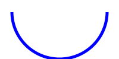

# Системы счисления.

# Снова про количество информации

- Но главное, а что значит "закодировать число"?

# Двоичная система счисления

- Это значит "взвесить" число на "весах"!

- с одной стороны весов: груз

- с другой стороны - гирьки 1, 2, 4, 8, ..., $2^N$

- "1" положить гирьку, а "0" --- убрать;

# Троичная симметричная 

- основание: 3

- цифры: -1, 0, +1

- примеры: ++ ($4_{10}$), +- ($+3-1=2$), -+ ($-3+1=-2$)

- для симм. систем счисления "гирьки" на весах можно класть на ту же чашу, что и сам груз;

- минимальная доступная симметричная позиционная система счисления

# Сравнение (пример)

Число $19_{10}$:

+------------+------------+-----------------+
|      x     |    1+2+16  |~~<1, 4, 8, ≥32~~|
+            +            +                 |
|||  $10011_2$      |
+------------+------------+-----------------+ 

+------------+------------+-----------------+
|      x+9   |    27+1    |~~<1,  3,   ≥81~~|
+            +            +                 |
||| $+-0+_{3C}$     |
+------------+------------+-----------------+

# Сравнение 2

+----------------+-------------------------+
|Двоичная        |Троичная симм.           |
+================+=========================+
|напряжение      | ток? момент?            |
+----------------+-------------------------+
|привычна        | инопланетянин           |
+----------------+-------------------------+
|экономна        |в теории,                |
|                | производительная        |
+----------------+-------------------------+
|минимальная     | минимальная симметричная|
+----------------+-------------------------+
|О.К., П.К., Д.К.|нативная поддержка минуса|
+----------------+-------------------------+

# Кодирование чисел в двоичных ячейках.

# Беззнаковые числа

- ```unsigned```-типы в C++ (```unsigned int, unsigned char, unsigned long int```, ...);

- все биты --- под двоичные цифры;

- диапазон от 0 до $2^k$;

- за 255 следует... снова 0 (цикличность значений)

# Carry flag

на примере ячейки 1 байт

```
   1111.1111
   0000.0001
------------
(1)0000.0000
```

255 + 1 = 0 (CF=1)

Когда емкость ячейки исчерпана
- нужно сделать "перенос" в/из ячейки старше,

*включается CF=1*

- Делается ли перенос автоматически? *Нет, просто дается флаг*

# Числа со знаком

- Как вообще кодировать знак числа, если доступны только цифры? 

- Как отдельно учесть что мы в *ячейке*?


# [1]{.underline}$000.0001_{П.К.}= -1_2$

- прямой код

- появился первым

- первый бит инвертируется, остальные как были

- понятен, но неудобен для схемотехники

- устарел, кроме как для кодирования дробных (см.дальше)

# [1]{.underline}$111.1110_{О.К.}= -1_2$

- обратный код

- инвертируются все биты

- универсальнее чем прямой, но тоже устарел

- обычно не используется совсем

# [1]{.underline}$111.1111_{Д.К.}= -1_2$

- дополнительный код

- обратный код + 1

- *цикличен*; что сложить 2+(-3), что вычесть 2-3

- доминирует при кодировании целых чисел со знаком

# overflow flag

7+1 = ```0111 + 0001 = 1000```

для ниббла в доп.коде $1000_{Д.К} = -8$

> Математический блокбастер
>
> "7 + 1 = -8"
>
>> от создателей 127 + 1 = -128 (для байта) 

- если мы "задеваем" старший бит, будет overflow flag (флаг переполнения)

# плавающая точка

Можно обойтись без них:

- рубли (просто пересчитай на копейки)
- фиксированная точность (две, три цифры после запятой)

Когда надо:

- разнородные величины (число Авогадро $6.022 140 76⋅10^{23}$, атомная масса водорода $1.67⋅10^{−24}$)

# IEEE 754

- ```float, double, long double``` из C++

- ```Number``` из JavaScript

- один бит - на знак

- один байт - на порядок

- остальное - на мантиссу

# Булева алгебра.

# три булевы функции

+----------------+------+---------------------+
|обозначение     |имя   | варианты обозначений|
+================+======+=====================+
| $\overline{a}$ | НЕ   | a', ¬a              |
+----------------+------+---------------------+
| $a\land{}b$    |И     | ab, $a\cdot{}b$     |
+----------------+------+---------------------+
| $a\lor{}b$     |ИЛИ   | a+b                 |
+----------------+------+---------------------+

# Идея Джорджа Буля

- Считаем что есть высказывания

- Они истинны или ложны

- Наша задача - узнать истину

- Давайте посчитаем!

- Ограничим алгебру сложением и умножением двух чисел

# История ИЛИ

Первоначально, Буль сделал "сложение" как исключающее ИЛИ:

$$a\oplus{}b$$

- Действительно, именно она ближе к действию сложения для двоичной системы счисления

$$0\oplus{}1 = 1\oplus{}0 = 1$$

$$0\oplus{}0 = 1\oplus{}1 = 0$$

Но...

# Победа $a\lor{}b$

- дело в том, что дизъюнкция --- это MAX(), а конъюнкция это MIN()

заменив все

- 0 на 1,
- 1 на 0
- прямые термины на отрицания,
- отрицания на прямые термины
- ИЛИ на И
- И на ИЛИ

получите то же самое выражение! (дуальность)

Из-за этого булева Алгебра "симметрична"

# Идея Порецкого

- А что если смысл не в высказываниях, а в признаках?

- пусть X - это определение, разделяющее все предметы в мире на x и x'

- в таком случае, конъюнкция --- это создание более строгого определения из двух других

- а дизъюнкция --- менее строгого

# пример

Пусть вкусное (В), полезное (П)

$В\lor{}П$ --- чем питается человек

$\overline{B\lor{}П}$ - то, чем человек не питается

По закону де Моргана,

$$\overline{B\lor{}П} = ¬В\cdot{}¬П$$

Значит, невкусное и неполезное есть человек не захочет точно.

# Дизъюнкция по множеству

$\bigvee{x}=$

- 1, если найден предмет с признаком x
- 0, если доказано, что предмета x не будет
- i, если неизвестно

# $\overline{\bigvee{x \overline {y}}}$

"Не бывает X без Y"

Вместе с условием сосуществования противоположностей составляет основу
*отношения следования* 

- определений следования - множество, *возможно* что это правильное.

# Пример для $\bigvee{x}$

Можно дедуктивно решать задачи!

$$\bigvee{Сократ}\cdot{}\bigvee{\overline{Сократ}}\cdot{}$$
$$\cdot{}\bigvee{Человек}\cdot{}\bigvee{\overline{Человек}}\cdot{}$$
$$\cdot{}\bigvee{Смертный}\cdot{}\bigvee{\overline{Смертный}}\cdot{}$$
$$\cdot{}\overline{\bigvee{Сократ \cdot{} \overline{Человек} }}\cdot{}$$
$$\cdot{}\overline{\bigvee{Человек \cdot{} \overline{Смертный} }}=$$
$$=\ldots{}\cdot{}\overline{\bigvee{Сократ \cdot{} \overline{Смертный}}}$$